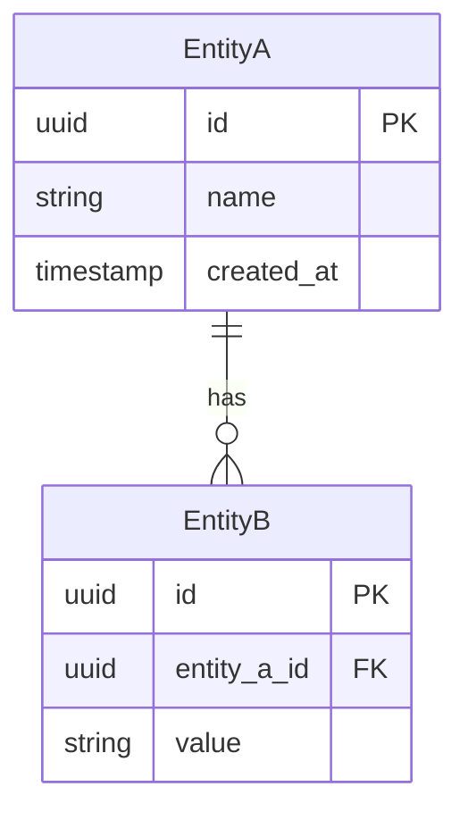
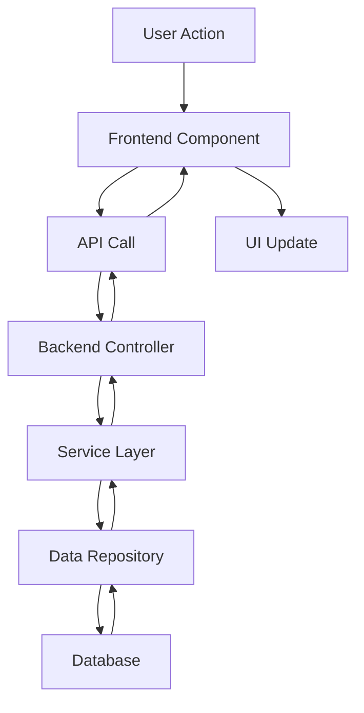

# Technical Architecture: [Feature Name]

## Architecture Summary

**Feature:** [Feature Name]
**Architecture Pattern:** [MVC/Microservices/Event-driven/etc.]
**Technology Stack:** [Primary technologies]
**Integration Complexity:** [Low/Medium/High]

## System Design Overview

### High-Level Architecture

[Describe the overall system design and how this feature fits into the existing architecture]

### Design Principles

- **Scalability:** [How the design supports growth]
- **Maintainability:** [How the code will be organized and maintained]
- **Performance:** [Key performance considerations]
- **Security:** [Security-first design principles]

## Component Architecture

### Frontend Components

#### Core Components

- **[ComponentName]**: [Purpose and responsibility]
  - Props: [Key props]
  - State: [State management approach]
  - Dependencies: [Other components/services]

#### Shared Components

- **[SharedComponent]**: [Reusable component description]
- **[UtilityComponent]**: [Utility component description]

#### State Management

- **Global State**: [Redux/Context/Zustand approach]
- **Local State**: [Component-level state strategy]
- **Data Fetching**: [API integration pattern]

### Backend Architecture

#### Service Layer

- **[ServiceName]**: [Business logic responsibility]
  - Methods: [Key methods]
  - Dependencies: [Database/external services]
  - Error Handling: [Error management approach]

#### API Layer

- **Controllers**: [Request handling strategy]
- **Middleware**: [Authentication/validation/logging]
- **Routing**: [URL structure and organization]

#### Data Layer

- **Models**: [Data model definitions]
- **Repositories**: [Data access patterns]
- **Migrations**: [Database change management]

## Data Architecture

### Database Design

#### New Tables

```sql
-- [Table Name]
CREATE TABLE [table_name] (
  id UUID PRIMARY KEY DEFAULT gen_random_uuid(),
  [field_name] [data_type] [constraints],
  created_at TIMESTAMPTZ DEFAULT NOW(),
  updated_at TIMESTAMPTZ DEFAULT NOW()
);

-- Indexes
CREATE INDEX idx_[table]_[field] ON [table_name] ([field_name]);
```

#### Schema Modifications

- **[ExistingTable]**: [Description of changes]
  ```sql
  ALTER TABLE [table_name] ADD COLUMN [new_field] [data_type];
  ```

#### Data Relationships



### Data Flow Architecture



## API Specification

### RESTful Endpoints

#### Create Resource

```http
POST /api/v1/[resource]
Content-Type: application/json
Authorization: Bearer [token]

{
  "[field]": "[value]",
  "[field2]": "[value2]"
}
```

**Response:**

```json
{
  "success": true,
  "data": {
    "id": "uuid",
    "[field]": "[value]",
    "created_at": "2024-01-01T00:00:00Z"
  },
  "meta": {
    "timestamp": "2024-01-01T00:00:00Z"
  }
}
```

#### Retrieve Resources

```http
GET /api/v1/[resource]?page=1&limit=20&filter=[value]
Authorization: Bearer [token]
```

### Error Response Format

```json
{
  "success": false,
  "error": {
    "code": "VALIDATION_ERROR",
    "message": "Invalid input data",
    "details": [
      {
        "field": "[field_name]",
        "message": "[specific error]"
      }
    ]
  },
  "meta": {
    "timestamp": "2024-01-01T00:00:00Z",
    "request_id": "uuid"
  }
}
```

## Security Architecture

### Authentication & Authorization

- **Authentication Method**: [JWT/OAuth2/Session-based]
- **Token Management**: [Storage and refresh strategy]
- **Role-Based Access**: [Permission model]
- **API Security**: [Rate limiting, CORS, headers]

### Data Protection

- **Encryption**: [At rest and in transit]
- **Input Validation**: [Sanitization and validation rules]
- **SQL Injection Prevention**: [Parameterized queries]
- **XSS Prevention**: [Output encoding and CSP]

## Performance Architecture

### Optimization Strategy

- **Database**: [Indexing, query optimization, connection pooling]
- **Caching**: [Redis/Memcached strategy, cache invalidation]
- **Frontend**: [Code splitting, lazy loading, asset optimization]
- **API**: [Response compression, pagination, field selection]

### Monitoring & Metrics

- **Performance Metrics**: [Response times, throughput, error rates]
- **Business Metrics**: [User engagement, conversion rates]
- **Infrastructure Metrics**: [CPU, memory, disk usage]
- **Custom Metrics**: [Feature-specific measurements]

## Integration Architecture

### External Services

- **[ServiceName]**: [Integration purpose and method]
  - Authentication: [API key/OAuth]
  - Rate Limits: [Request limits]
  - Error Handling: [Retry logic, fallbacks]

### Internal Services

- **[InternalService]**: [Communication method]
- **Event System**: [Event-driven communication]
- **Message Queue**: [Async processing]

## Deployment Architecture

### Environment Configuration

- **Development**: [Local setup requirements]
- **Staging**: [Pre-production environment]
- **Production**: [Live environment specifications]

### Infrastructure Requirements

- **Compute**: [Server/container specifications]
- **Storage**: [Database and file storage needs]
- **Network**: [Load balancing, CDN requirements]
- **Monitoring**: [Logging and alerting setup]

### Deployment Strategy

- **CI/CD Pipeline**: [Build, test, deploy process]
- **Database Migrations**: [Migration strategy and rollback]
- **Feature Flags**: [Gradual rollout approach]
- **Rollback Plan**: [Quick rollback procedures]

## Risk Assessment

### Technical Risks

- **[Risk 1]**: [Description and mitigation]
- **[Risk 2]**: [Description and mitigation]

### Performance Risks

- **Scalability**: [Potential bottlenecks]
- **Database**: [Query performance concerns]

### Security Risks

- **Data Exposure**: [Sensitive data handling]
- **Access Control**: [Permission escalation risks]

## Future Architecture

### Scalability Considerations

- **Horizontal Scaling**: [How to scale out]
- **Vertical Scaling**: [Resource upgrade path]
- **Database Scaling**: [Sharding, read replicas]

### Extension Points

- **Plugin Architecture**: [How to add new features]
- **API Versioning**: [Backward compatibility strategy]
- **Microservices Migration**: [Future service extraction]

## Documentation & Maintenance

### Code Documentation

- **API Documentation**: [OpenAPI/Swagger specs]
- **Code Comments**: [Inline documentation standards]
- **Architecture Decision Records**: [ADR documentation]

### Maintenance Strategy

- **Code Reviews**: [Review process and standards]
- **Testing Strategy**: [Automated testing approach]
- **Monitoring**: [Health checks and alerting]
- **Updates**: [Dependency and security updates]

---

**Architecture Review**: [Date]
**Technical Lead**: [Name]
**Security Review**: [Date]
**Performance Review**: [Date]
